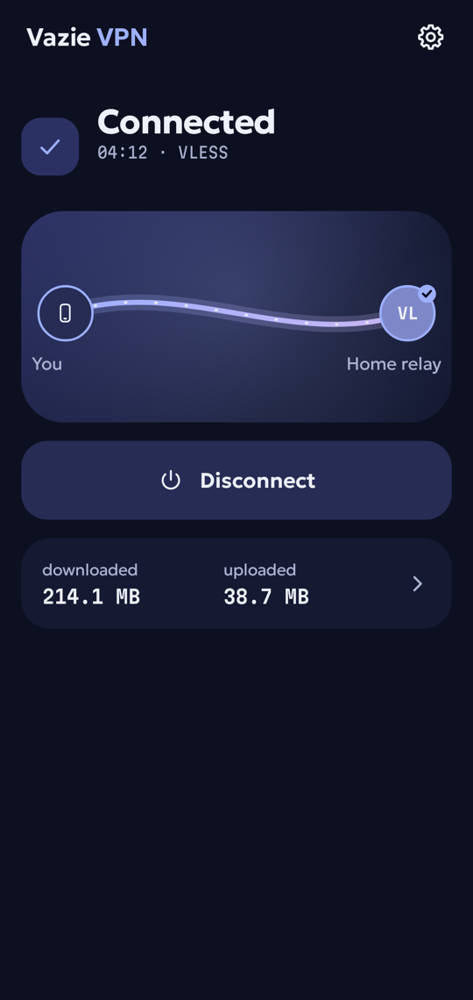
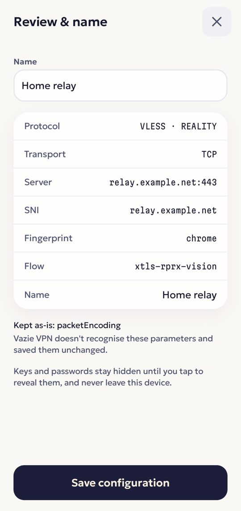
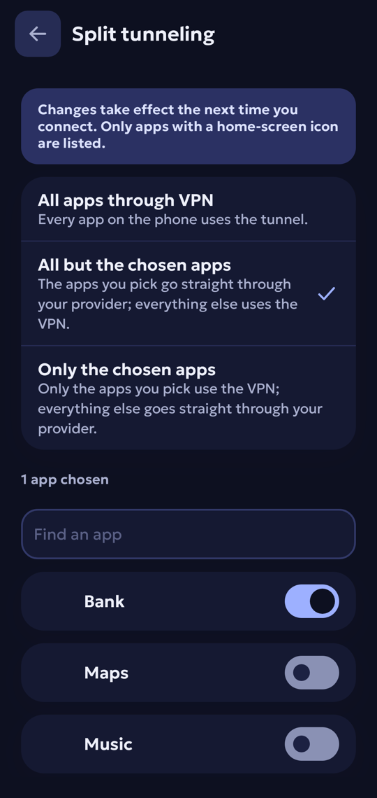
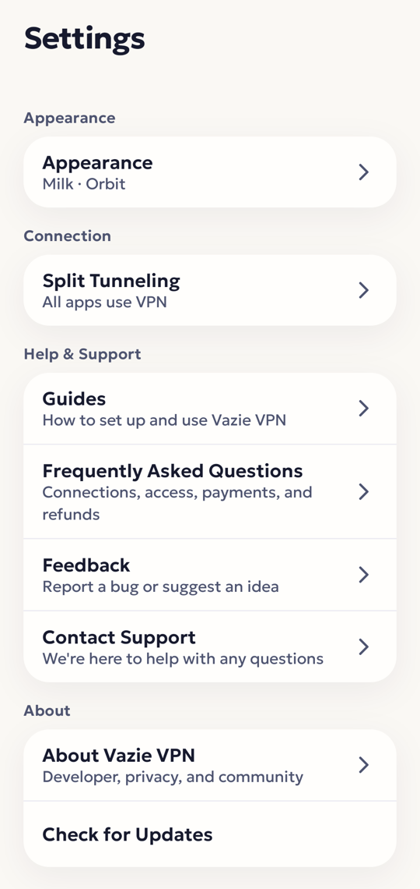

**English** | [Русский](README.ru.md)

<p align="center">
  
</p>

<h1 align="center">Vazie VPN</h1>

<p align="center">
  An Android VPN client that runs <b>your own</b> VLESS configuration — free, with no account —<br>
  and, with VPN Plus, Vazie's servers.
</p>

<p align="center">
  <a href="https://vazie.app/vpn">Download the APK</a> ·
  <a href="https://vazie.app">vazie.app</a> ·
  <a href="https://vazie.app/legal/privacy">Privacy policy</a> ·
  <a href="https://t.me/vazieapp">Telegram</a>
</p>

<p align="center">
  
  
  
  
</p>

## What it does

You have a `vless://` link from a server you rent, run or were given. Vazie VPN opens a full Android
tunnel through it, with [Xray](https://github.com/XTLS/Xray-core) as the engine. A fresh install does
nothing until you paste a link or, with VPN Plus, pick a Vazie server.

- **Your own configurations.** A link is parsed, validated and stored encrypted. One the app cannot
  run is refused before the tunnel starts, with the reason.
- **Honest "Connected".** Once the tunnel is up the app proves that packets, DNS and TLS each work,
  and says which one failed if one does.
- **Split tunneling.** Every app, all but the chosen ones, or only the chosen ones — without the
  "see every installed app" permission.
- **Outside the app.** A quick settings tile, two home-screen widgets, launcher shortcuts and a
  notification with a disconnect button.
- **VPN Plus.** Vazie's servers for a one-off payment per month or year; nothing renews by itself.
- **Two themes, ten launcher icons, English and Russian.**

| | Supported |
|---|---|
| Protocol | VLESS |
| Transport | TCP, WebSocket, gRPC |
| Security | none, TLS, REALITY (`xtls-rprx-vision` on TCP) |
| Endpoint | a domain name or an IPv4 address |
| Android | 9 and newer |

Not yet: WireGuard, VMess, Trojan, Shadowsocks, subscription URLs, QR codes, IPv6 endpoints,
a kill switch and auto-reconnect. Inside the tunnel IPv6 is blocked rather than routed, so it cannot
leak around it.

## Where it connects

The complete list — a VPN client should not talk to anyone you were not told about.

| Endpoint | When | Through the tunnel? | Why |
|---|---|---|---|
| `1.1.1.1:53` | connecting, if your endpoint is a hostname | **No** | Resolve your server's name before the tunnel exists |
| `https://1.1.1.1/dns-query`, `https://8.8.8.8/dns-query` | while connected | Yes | Every DNS query the device makes |
| `https://1.1.1.1/`, `https://8.8.8.8/`, `example.com` (DNS) | once per connection | Yes | Prove the tunnel carries TLS and resolves names |
| Your servers and Vazie servers | while the server list is on screen | **No** | Latency: a TCP handshake, closed at once, no data sent |
| `api.vazie.app` | when Settings or About opens | As the device routes it | Links on the About screen; no account data sent |
| `api.vazie.app`, `vpn.api.vazie.app` | only if you sign in | As the device routes it | Sign-in, the account, VPN Plus |
| Yandex AppMetrica | only if you allowed reports | As the device routes it | Crash and payment-outcome reports |

Nothing else.

## Under the hood

Kotlin, Jetpack Compose, Glance, Hilt, Ktor, Android `VpnService` and Xray-core through libXray.
Features never touch the engine, the network or storage — only `:app` wires implementations together,
and a convention plugin in [`build-logic`](build-logic) fails the build when a module crosses a boundary.

- [`Secret`](core/model/src/main/kotlin/app/vazie/vpn/core/model/Secret.kt) wraps credentials so they
  cannot reach a log, an exception message or a crash report by accident.
- Configurations are encrypted with a key in the Android Keystore; system backup is off.
- The native engine is pinned to one release and verified by SHA-256 before use.
- CI opens every minified release APK and fails on a credential shape, a debug tool or an unexpected host.
- Tests assert that no credential is compiled into the sources and that widget state carries no secrets.

## Building

JDK 21 and the Android SDK. The Gradle wrapper jar is not committed: Android Studio needs nothing, and
on the command line generate it once.

```bash
gradle wrapper --gradle-version 9.4.1
./gradlew check
./gradlew :app:installDirectDebug
```

`local.properties` needs three endpoints — any https URLs will do for a build:

```properties
vazie.api.url=https://api.example.com/v1
vazie.vpnApi.url=https://vpn.api.example.com/v1
vazie.site.url=https://example.com
```

## Security

Report vulnerabilities privately — see [SECURITY.md](SECURITY.md). Never include your configuration
or a `vless://` link: it is a credential.

## Author and licence

Designed, built and run by one person — **Vazovsky**: the app, the backend, the site and the servers.
Telegram [@vazovsky17](https://t.me/vazovsky17) · support [@vazieapp](https://t.me/vazieapp).

The code is open so that anyone can **study it and check its security and privacy**. It is not open
source: redistributing it or builds of it, publishing forks, using the Vazie name and marks, or pointing
modified builds at Vazie's servers is not permitted. See [LICENSE](LICENSE) and [NOTICE.md](NOTICE.md).
