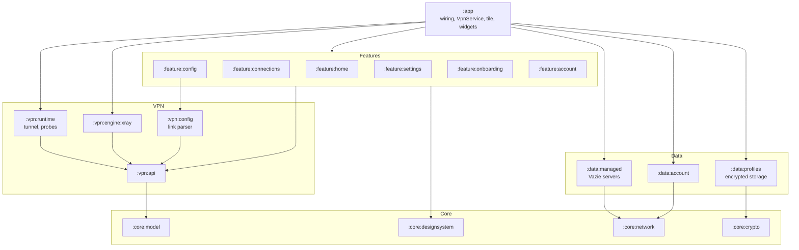

**English** | [Русский](README.ru.md)

<p align="center">
  
</p>

<h1 align="center">Vazie VPN</h1>

<p align="center">
  An Android VPN client that runs <b>your</b> VLESS configuration — free, with no account —<br>
  and, with VPN Plus, Vazie's own servers.
</p>

<p align="center">
  
  
  
  
  
</p>

<p align="center">
  <a href="https://vazie.app">vazie.app</a> ·
  <a href="https://vazie.app/vpn">Download the APK</a> ·
  <a href="https://vazie.app/legal/privacy">Privacy policy</a>
</p>

<table>
  <tr>
    <td></td>
    <td></td>
    <td></td>
  </tr>
  <tr>
    <td></td>
    <td></td>
    <td></td>
  </tr>
</table>

---

## What it is

You already have a VLESS link from a server you rent, run, or were given. Vazie opens a real Android
full tunnel through it, with [Xray](https://github.com/XTLS/Xray-core) as the engine. A fresh install
has nothing selected and does nothing until you paste a link or, with VPN Plus, pick a Vazie server.

The whole product — this app, the Kotlin backend, the website and the servers — is designed, built
and run by one person.

## Features

- **Your own configurations.** Paste a `vless://` link; it is parsed, validated and stored encrypted.
  A link Vazie cannot run is refused before the tunnel starts, with a reason — never a guess.
- **VPN Plus.** Vazie's servers for a one-off payment per month or year, no auto-renewal.
  Sign-in is by a code sent to your email; the account can be deleted from the app.
- **Split tunneling.** All apps through the VPN, all but the chosen ones, or only the chosen ones —
  picked from a searchable list of apps, without the broad "see every installed app" permission.
- **Tunnel health, not just "connected".** After the tunnel comes up the app proves that packets,
  DNS and TLS each work, and says which one failed if one does.
- **Outside the app.** A quick settings tile, two home-screen widgets (Glance), launcher shortcuts
  for up to three configurations and a connection notification with a disconnect button.
- **Made to be looked at.** Two themes (Night Indigo, Milk), ten launcher icons, each on its own
  background or on Light and Ink, a first-run tour, a Settings tour and built-in guides. English and
  Russian.

## What it supports, exactly

What the parser and the engine accept today.

| | Supported |
|---|---|
| Engine | Xray (libXray `v26.7.28`) |
| Protocol | VLESS |
| Transport | TCP, WebSocket (`ws`, `websocket`), gRPC |
| Security | none, TLS, REALITY |
| Flow | `xtls-rprx-vision` — TCP only, and only with TLS or REALITY |
| Endpoint | a domain name or an IPv4 literal |
| Import / export | paste a `vless://` link / share it through the system share sheet |

**Not supported yet, but planned**: WireGuard, VMess, Trojan, Shadowsocks, raw Xray JSON, subscription URLs, QR codes,
file import, IPv6 endpoint literals.

## Architecture

23 Gradle modules, split so that each sees only what it needs. Features never touch the engine, the
network or storage; only `:app` wires implementations together.



The boundaries are enforced, not just drawn: a convention plugin checks 12 dependency rules on every
build. For example:

| Rule | |
|---|---|
| R2 | features depend on `:vpn:api` only, never on an implementation |
| R3 | only `:app` may depend on an engine |
| R12 | only `:app` may depend on a `:data:*` module |
| R14 | only `:app` and `:data:*` may reach the network client |
| R15 | no `:vpn:*` module may know about Vazie's own servers |

Build configuration lives in [`build-logic`](build-logic) as convention plugins: Android, Compose,
Hilt, lint, tests, previews and the module rules.

## Engineering notes

A few things in the code worth reading:

- **[`Secret`](core/model/src/main/kotlin/app/vazie/vpn/core/model/Secret.kt)** — credentials are
  wrapped so that they cannot reach a log, an exception message or a crash report by accident.
- **[`TunnelReadinessProbe`](vpn/runtime/src/main/kotlin/app/vazie/vpn/runtime/TunnelReadinessProbe.kt)**
  — a coroutine timeout cannot interrupt a blocking DNS call; the probe is built around that fact,
  after it once left a connection stuck in "Connecting" for good.
- **Release artifact scan** — CI opens the minified release APKs and fails if the dex or resources
  contain a credential shape, a debug tool, an internal API path or an unsupported protocol.
- **Pinned native engine** — the libXray archive comes from a fixed release and is checked by
  SHA-256 before use; CI generates the Gradle wrapper jar from the pinned version and validates it.
- **Encrypted storage** — configurations are encrypted with a key in the Android Keystore; system
  backup and cloud extraction are disabled.
- **Tests that guard privacy** — tests assert that no credential is compiled into the sources and that
  widget state carries no secrets.

## Where it connects

A VPN client that quietly talks to a third party while claiming to speak only to your server has lied
in its own privacy policy. The complete list:

| Endpoint | When | Through the tunnel? | Why |
|---|---|---|---|
| `1.1.1.1:53` | connecting, only if your endpoint is a hostname | **No** — on a protected socket | Resolve your own server's name before the tunnel exists |
| `https://1.1.1.1/dns-query`, `https://8.8.8.8/dns-query` | while connected | Yes | Every DNS query the device makes |
| `https://1.1.1.1/`, `https://8.8.8.8/` | once per connection | Yes | Prove the tunnel carries a TLS session |
| `example.com` (DNS) | once per connection | Yes | Prove names resolve through the tunnel |
| Your servers and Vazie servers | while the server list is on screen, every 30 s | **No** | Latency bars: a TCP handshake, closed at once, no data sent |
| `api.vazie.app`, `vpn.api.vazie.app` | only if you sign in | Whichever way the device routes it | Sign-in, the account, VPN Plus |
| Yandex AppMetrica | only if you allowed crash reports | Whichever way the device routes it | Crash reports |

Nothing else.

## Tech stack

| | |
|---|---|
| Language | Kotlin 2.2, coroutines, kotlinx.serialization |
| UI | Jetpack Compose (Material 3), Glance widgets, a design-system catalog app (`:catalog`) |
| DI | Hilt |
| Networking | Ktor client on OkHttp |
| VPN | Android `VpnService`, Xray-core via libXray (gomobile) |
| Storage | Android Keystore + AES-GCM, app-private files |
| Tests | JUnit, Robolectric, Compose UI tests, Ktor MockEngine — 950+ tests |
| Build | Gradle 9, convention plugins, version catalog, R8 |
| CI | GitHub Actions: checks, minified release, artifact scan, per-store builds |

## Building

```bash
./gradlew check
./gradlew :app:assembleDirectRelease
```

Requires JDK 21; `gradle/wrapper/gradle-wrapper.properties` pins Gradle and its checksum. The wrapper jar
is not committed: Android Studio needs nothing, and for the command line generate it once with
`gradle wrapper --gradle-version 9.4.1`.

| Setting | Where | |
|---|---|---|
| `vazie.api.url`, `vazie.vpnApi.url`, `vazie.site.url` | `local.properties` or `VAZIE_API_URL`, `VAZIE_VPN_API_URL`, `VAZIE_SITE_URL` | Required; https, no trailing slash, checked at build time |
| `appmetrica.apiKey` | `local.properties` or `APPMETRICA_API_KEY` | Secret; without it, crash reports are off |
| Signing | `signKeystore/key.properties` or `VAZIE_KEYSTORE_*`, `VAZIE_KEY_*` | Secret; without it, the release is unsigned |

In CI the environment variables come from GitHub secrets. A checkout builds once `local.properties` has:

```properties
vazie.api.url=https://api.example.com/v1
vazie.vpnApi.url=https://vpn.api.example.com/v1
vazie.site.url=https://example.com
```

Variants: four distribution flavors (`direct`, `play`, `huawei`, `samsung`) × `debug`, `qa`, `release`.
`direct` — the APK from [vazie.app](https://vazie.app) — comes first; Google Play follows right after
the release; AppGallery and Galaxy Store are planned for 2027.

## Known limitations

- **IPv6 does not work inside the tunnel.** It is blocked rather than routed, so it cannot leak around
  the tunnel; IPv6-only destinations are unreachable while connected.
- **The bootstrap DNS query is plaintext.** An IP literal in your link avoids it.
- **No auto-reconnect or kill switch yet.** The app does not show switches it cannot honour.
- **Split tunneling applies from the next connection.** Changing it does not touch a tunnel that is up.
- **A tunnel is not anonymity.** Your server operator can see everything your ISP could.

## Security

Report vulnerabilities privately — to [@vazovsky17](https://t.me/vazovsky17) on Telegram or through
GitHub private vulnerability reporting — not in a public issue. Never include your configuration or a
`vless://` link: it is a credential.

## Author

Designed and built by **Vazovsky** — Android, backend, web and infrastructure.
Telegram [@vazovsky17](https://t.me/vazovsky17) · Vazie support [@vazieapp](https://t.me/vazieapp).

## Licence

The code is open so that anyone can **study it and check its security and privacy**. It is **not** open
source: redistributing it or builds of it, releasing forks or rebranded copies, using the Vazie name
and marks, or pointing modified builds at Vazie's servers is not permitted. See [LICENSE](LICENSE);
third-party components keep their own licences, listed in [NOTICE.md](NOTICE.md).
