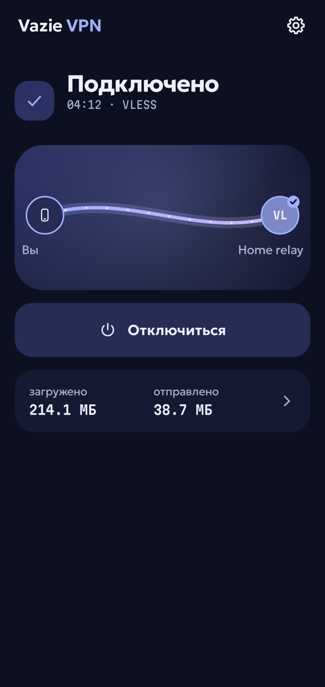
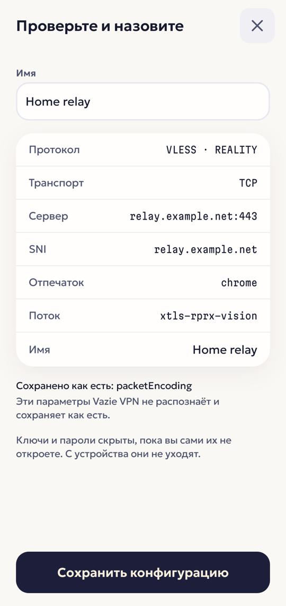
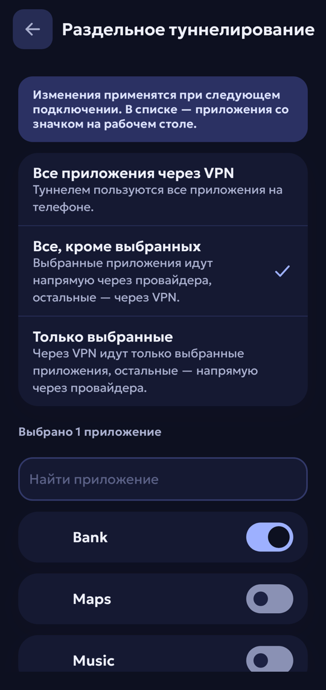
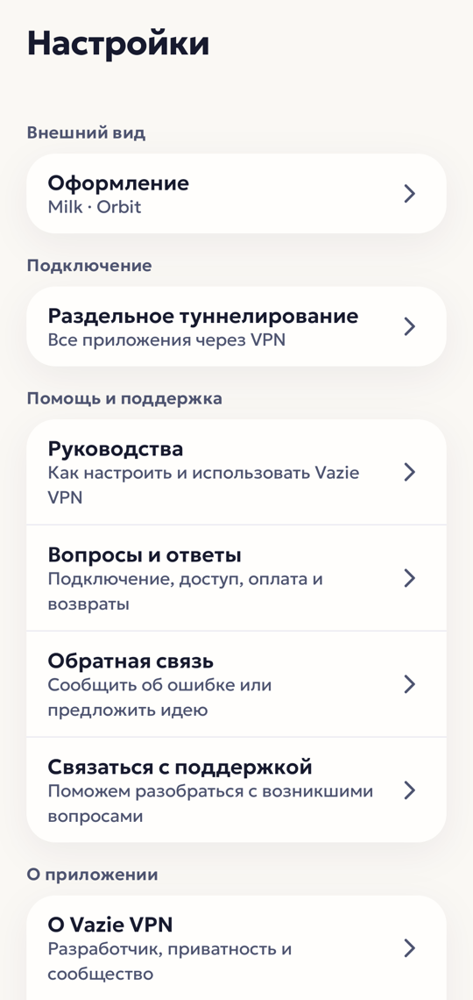

[English](README.md) | **Русский**

<p align="center">
  
</p>

<h1 align="center">Vazie VPN</h1>

<p align="center">
  VPN-клиент для Android, который работает с <b>вашей</b> конфигурацией VLESS — бесплатно и без аккаунта —<br>
  а с VPN Plus ещё и с серверами Vazie.
</p>

<p align="center">
  <a href="https://vazie.app/vpn">Скачать APK</a> ·
  <a href="https://vazie.app">vazie.app</a> ·
  <a href="https://vazie.app/legal/privacy">Политика конфиденциальности</a> ·
  <a href="https://t.me/vazieapp">Telegram</a>
</p>

<p align="center">
  
  
  
  
</p>

## Что это

У вас есть ссылка `vless://` — от сервера, который вы арендуете, держите сами или получили от кого-то.
Vazie VPN поднимает через неё полноценный туннель Android; движок —
[Xray](https://github.com/XTLS/Xray-core). После установки приложение ничего не делает, пока вы не
вставите ссылку или, с VPN Plus, не выберете сервер Vazie.

- **Свои конфигурации.** Ссылка разбирается, проверяется и хранится зашифрованной. Ту, что приложение
  запустить не может, оно отклоняет до подключения и объясняет почему.
- **Честное «Подключено».** Когда туннель поднят, приложение проверяет, что по нему идут пакеты, DNS
  и TLS, и говорит, что именно не работает.
- **Раздельное туннелирование.** Все приложения, все кроме выбранных или только выбранные — без
  разрешения «видеть все установленные приложения».
- **Вне приложения.** Плитка в шторке, два виджета, ярлыки на значке и уведомление с кнопкой отключения.
- **VPN Plus.** Серверы Vazie за разовую оплату на месяц или год; само ничего не продлевается.
- **Две темы, десять значков, русский и английский.**

| | Поддерживается |
|---|---|
| Протокол | VLESS |
| Транспорт | TCP, WebSocket, gRPC |
| Защита | без защиты, TLS, REALITY (`xtls-rprx-vision` поверх TCP) |
| Адрес сервера | доменное имя или IPv4 |
| Android | 9 и новее |

Пока нет: WireGuard, VMess, Trojan, Shadowsocks, ссылок-подписок, QR-кодов, IPv6-адресов сервера,
kill switch и автопереподключения. Внутри туннеля IPv6 блокируется, а не маршрутизируется, — утечь
мимо туннеля он не может.

## Куда оно подключается

Полный список: VPN-клиент не должен общаться с кем-то, о ком вам не сказали.

| Адрес | Когда | Через туннель? | Зачем |
|---|---|---|---|
| `1.1.1.1:53` | при подключении, если сервер задан именем | **Нет** | Узнать адрес вашего сервера, пока туннеля ещё нет |
| `https://1.1.1.1/dns-query`, `https://8.8.8.8/dns-query` | пока подключено | Да | Все DNS-запросы устройства |
| `https://1.1.1.1/`, `https://8.8.8.8/`, `example.com` (DNS) | раз за подключение | Да | Проверить, что туннель несёт TLS и разрешает имена |
| Ваши серверы и серверы Vazie | пока открыт список серверов | **Нет** | Задержка: TCP-рукопожатие, сразу закрывается, данных не шлёт |
| `api.vazie.app` | при открытии «Настроек» или «О приложении» | Как маршрутизирует устройство | Ссылки на экране «О приложении»; данные аккаунта не передаются |
| `api.vazie.app`, `vpn.api.vazie.app` | только если вы вошли | Как маршрутизирует устройство | Вход, аккаунт, VPN Plus |
| Яндекс AppMetrica | только если вы разрешили отчёты | Как маршрутизирует устройство | Отчёты о сбоях и итоге оплаты |

Больше никуда.

## Как устроено

Kotlin, Jetpack Compose, Glance, Hilt, Ktor, `VpnService` и Xray-core через libXray. Экраны не
касаются движка, сети и хранилища — реализации связывает только `:app`, а convention-плагин в
[`build-logic`](build-logic) роняет сборку, если модуль выходит за свои границы.

- [`Secret`](core/model/src/main/kotlin/app/vazie/vpn/core/model/Secret.kt) оборачивает учётные данные
  так, что они не попадут в лог, текст исключения или отчёт о сбое случайно.
- Конфигурации зашифрованы ключом из Android Keystore; системное резервное копирование выключено.
- Нативный движок закреплён на одном релизе и проверяется по SHA-256 перед использованием.
- CI вскрывает каждый минифицированный релизный APK и падает, если находит что-то похожее на учётные
  данные, отладочный инструмент или неожиданный хост.
- Тесты проверяют, что в исходниках нет учётных данных, а состояние виджетов не несёт секретов.

## Сборка

JDK 21 и Android SDK. Jar Gradle-обёртки в репозитории нет: Android Studio он не нужен, а для
командной строки его достаточно один раз сгенерировать.

```bash
gradle wrapper --gradle-version 9.4.1
./gradlew check
./gradlew :app:installDirectDebug
```

В `local.properties` нужны три адреса — для сборки подойдут любые https:

```properties
vazie.api.url=https://api.example.com/v1
vazie.vpnApi.url=https://vpn.api.example.com/v1
vazie.site.url=https://example.com
```

## Безопасность

Об уязвимостях сообщайте приватно — см. [SECURITY.md](SECURITY.md). Никогда не прикладывайте свою
конфигурацию или ссылку `vless://`: это учётные данные.

## Автор и лицензия

Придумал, сделал и поддерживает один человек — **Vazovsky**: приложение, backend, сайт и серверы.
Telegram [@vazovsky17](https://t.me/vazovsky17) · поддержка [@vazieapp](https://t.me/vazieapp).

Код открыт, чтобы любой мог **изучить его и проверить безопасность и приватность**. Это не open
source: распространять код или сборки, публиковать форки, использовать имя и знаки Vazie, подключать
изменённые сборки к серверам Vazie нельзя. См. [LICENSE](LICENSE) и [NOTICE.md](NOTICE.md).
