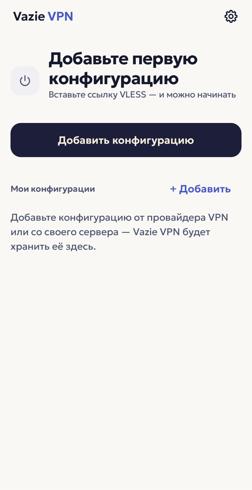
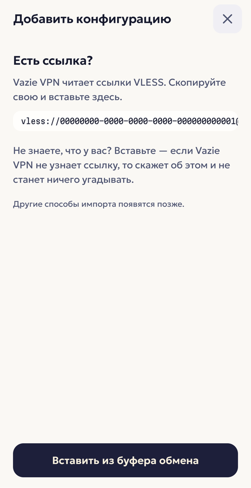
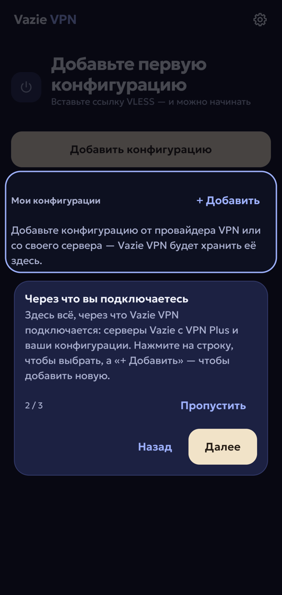
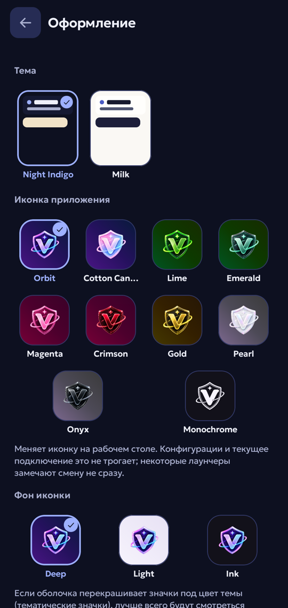
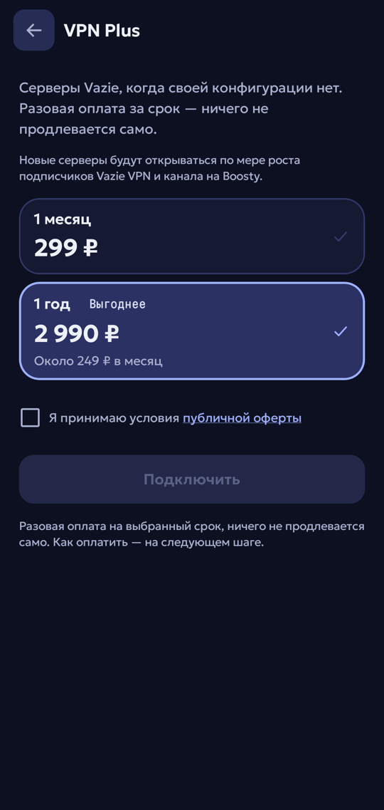
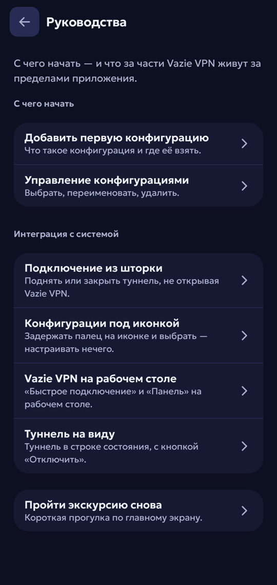
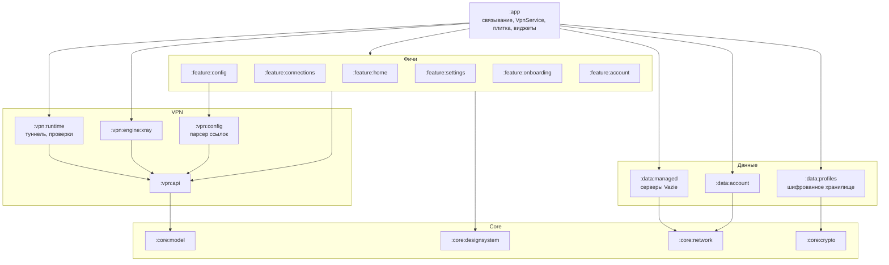

[English](README.md) | **Русский**

<p align="center">
  
</p>

<h1 align="center">Vazie VPN</h1>

<p align="center">
  VPN-клиент для Android, который запускает <b>вашу</b> конфигурацию VLESS — бесплатно и без аккаунта, —<br>
  а с VPN Plus — серверы Vazie.
</p>

<p align="center">
  
  
  
  
  
</p>

<p align="center">
  <a href="https://vazie.app">vazie.app</a> ·
  <a href="https://vazie.app/vpn">Скачать APK</a> ·
  <a href="https://vazie.app/legal/privacy">Политика конфиденциальности</a>
</p>

<table>
  <tr>
    <td></td>
    <td></td>
    <td></td>
  </tr>
  <tr>
    <td></td>
    <td></td>
    <td></td>
  </tr>
</table>

---

## Что это

У вас уже есть ссылка VLESS — от сервера, который вы арендуете, держите сами или получили. Vazie
поднимает через неё настоящий полный туннель Android, движок — [Xray](https://github.com/XTLS/Xray-core).
После установки ничего не выбрано, и приложение ничего не делает, пока вы не вставите ссылку или,
с VPN Plus, не выберете сервер Vazie.

Весь продукт — это приложение, бэкенд на Kotlin, сайт и серверы — придуман, сделан и поддерживается
одним человеком.

## Возможности

- **Свои конфигурации.** Вставьте ссылку `vless://` — она разбирается, проверяется и хранится
  зашифрованной. Ссылку, которую Vazie не сможет запустить, приложение отклонит до подъёма туннеля
  и объяснит почему — без догадок.
- **VPN Plus.** Серверы Vazie за разовую оплату на месяц или год, без автопродления. Вход — по коду
  из письма; аккаунт можно удалить прямо в приложении.
- **Раздельное туннелирование.** Все приложения через VPN, все, кроме выбранных, или только выбранные —
  из списка приложений с поиском и без широкого разрешения «видеть всё установленное».
- **Здоровье туннеля, а не просто «подключено».** После подъёма туннеля приложение проверяет, что
  проходят пакеты, DNS и TLS, и говорит, что именно сломалось, если что-то сломалось.
- **За пределами приложения.** Плитка в шторке, два виджета рабочего стола (Glance), ярлыки на иконке
  для трёх конфигураций и уведомление о подключении с кнопкой «Отключить».
- **Приятно смотреть.** Две темы (Night Indigo, Milk), десять иконок приложения — каждая на своём фоне
  или на Light и Ink, — экскурсия при первом запуске, экскурсия по настройкам и встроенные руководства.
  Английский и русский.

## Что поддерживается — точно

То, что парсер и движок принимают сегодня.

| | Поддерживается |
|---|---|
| Движок | Xray (libXray `v26.7.28`) |
| Протокол | VLESS |
| Транспорт | TCP, WebSocket (`ws`, `websocket`), gRPC |
| Безопасность | none, TLS, REALITY |
| Flow | `xtls-rprx-vision` — только TCP и только с TLS или REALITY |
| Адрес | доменное имя или IPv4 |
| Импорт / экспорт | вставка ссылки `vless://` / отправка через системное меню «Поделиться» |

**Пока не поддерживается, но планируется**: WireGuard, VMess, Trojan, Shadowsocks, сырой JSON Xray, ссылки-подписки,
QR-коды, импорт из файла, IPv6-адреса серверов.

## Архитектура

23 модуля Gradle, разделённых так, чтобы каждый видел только нужное. Фичи не касаются движка, сети и
хранилища; реализации связывает только `:app`.



Границы не только нарисованы, но и проверяются: convention-плагин на каждой сборке сверяет 12 правил
зависимостей. Например:

| Правило | |
|---|---|
| R2 | фичи зависят только от `:vpn:api`, никогда от реализации |
| R3 | от движка может зависеть только `:app` |
| R12 | от модулей `:data:*` может зависеть только `:app` |
| R14 | до сетевого клиента дотягиваются только `:app` и `:data:*` |
| R15 | ни один модуль `:vpn:*` не знает о серверах Vazie |

Настройка сборки — в [`build-logic`](build-logic), convention-плагинами: Android, Compose, Hilt,
lint, тесты, превью и правила модулей.

## Что стоит прочитать в коде

- **[`Secret`](core/model/src/main/kotlin/app/vazie/vpn/core/model/Secret.kt)** — учётные данные
  обёрнуты так, что случайно не попадут в лог, текст исключения или отчёт о сбое.
- **[`TunnelReadinessProbe`](vpn/runtime/src/main/kotlin/app/vazie/vpn/runtime/TunnelReadinessProbe.kt)**
  — таймаут корутины не прерывает блокирующий DNS-вызов; проверка построена вокруг этого факта после
  того, как однажды подключение навсегда зависло в «Подключении».
- **Проверка релизного артефакта** — CI открывает минифицированные релизные APK и падает, если в dex
  или ресурсах есть что-то похожее на учётные данные, отладочный инструмент, внутренний путь API или
  неподдерживаемый протокол.
- **Закреплённый движок** — архив libXray берётся из фиксированного релиза и сверяется по SHA-256;
  jar Gradle wrapper CI генерирует из закреплённой версии и проверяет.
- **Шифрованное хранилище** — конфигурации шифруются ключом из Android Keystore; системный бэкап и
  облачное извлечение выключены.
- **Тесты на приватность** — тесты проверяют, что в исходниках нет зашитых учётных данных, а в
  состоянии виджетов — секретов.

## Куда приложение подключается

VPN-клиент, который тихо обращается к третьим лицам, утверждая, что говорит только с вашим сервером,
солгал в собственной политике конфиденциальности. Полный список:

| Адрес | Когда | Через туннель? | Зачем |
|---|---|---|---|
| `1.1.1.1:53` | при подключении, только если адрес сервера — имя | **Нет** — через защищённый сокет | Узнать адрес вашего сервера, пока туннеля ещё нет |
| `https://1.1.1.1/dns-query`, `https://8.8.8.8/dns-query` | пока подключено | Да | Все DNS-запросы устройства |
| `https://1.1.1.1/`, `https://8.8.8.8/` | один раз за подключение | Да | Убедиться, что туннель проводит TLS |
| `example.com` (DNS) | один раз за подключение | Да | Убедиться, что имена разрешаются через туннель |
| Ваши серверы и серверы Vazie | пока на экране список серверов, раз в 30 с | **Нет** | Индикатор задержки: TCP-рукопожатие, сразу закрывается, данные не передаются |
| `api.vazie.app`, `vpn.api.vazie.app` | только если вы вошли в аккаунт | Как маршрутизирует устройство | Вход, аккаунт, VPN Plus |
| Яндекс AppMetrica | только если вы разрешили отчёты о сбоях | Как маршрутизирует устройство | Отчёты о сбоях |

Больше никуда.

## Технологии

| | |
|---|---|
| Язык | Kotlin 2.2, корутины, kotlinx.serialization |
| UI | Jetpack Compose (Material 3), виджеты на Glance, приложение-каталог дизайн-системы (`:catalog`) |
| DI | Hilt |
| Сеть | Ktor client на OkHttp |
| VPN | Android `VpnService`, Xray-core через libXray (gomobile) |
| Хранилище | Android Keystore + AES-GCM, приватные файлы приложения |
| Тесты | JUnit, Robolectric, Compose UI-тесты, Ktor MockEngine — больше 950 тестов |
| Сборка | Gradle 9, convention-плагины, version catalog, R8 |
| CI | GitHub Actions: проверки, минифицированный релиз, проверка артефакта, сборки для магазинов |

## Сборка

```bash
./gradlew check
./gradlew :app:assembleDirectRelease
```

Нужен JDK 21; версию Gradle и её контрольную сумму закрепляет `gradle/wrapper/gradle-wrapper.properties`.
Jar wrapper-а не хранится в репозитории: Android Studio он не нужен, а для командной строки его один раз
создаёт `gradle wrapper --gradle-version 9.4.1`.

| Настройка | Где | |
|---|---|---|
| `vazie.api.url`, `vazie.vpnApi.url`, `vazie.site.url` | `local.properties` или `VAZIE_API_URL`, `VAZIE_VPN_API_URL`, `VAZIE_SITE_URL` | Обязательны; https без слэша в конце, проверяются при сборке |
| `appmetrica.apiKey` | `local.properties` или `APPMETRICA_API_KEY` | Секрет; без него отчётов о сбоях нет |
| Подпись | `signKeystore/key.properties` или `VAZIE_KEYSTORE_*`, `VAZIE_KEY_*` | Секрет; без него релиз не подписан |

В CI переменные окружения берутся из GitHub secrets. Чтобы собрать checkout, добавьте в `local.properties`:

```properties
vazie.api.url=https://api.example.com/v1
vazie.vpnApi.url=https://vpn.api.example.com/v1
vazie.site.url=https://example.com
```

Варианты: четыре flavor-а распространения (`direct`, `play`, `huawei`, `samsung`) × `debug`, `qa`,
`release`. Первым — `direct`, APK с [vazie.app](https://vazie.app); Google Play — сразу после релиза;
AppGallery и Galaxy Store — в 2027 году.

## Известные ограничения

- **IPv6 внутри туннеля не работает.** Он блокируется, а не маршрутизируется, поэтому не утекает в
  обход туннеля; адреса только с IPv6 при подключении недоступны.
- **Первый DNS-запрос не зашифрован.** Этого можно избежать, указав в ссылке IP-адрес.
- **Пока нет автопереподключения и kill switch.** Приложение не показывает переключатели, которые не
  может выполнить.
- **Раздельное туннелирование применяется со следующего подключения.** Уже поднятый туннель оно не
  меняет.
- **Туннель — не анонимность.** Оператор вашего сервера видит всё то же, что видел бы провайдер.

## Безопасность

Об уязвимостях сообщайте приватно — в Telegram [@vazovsky17](https://t.me/vazovsky17) или через
приватные сообщения об уязвимостях на GitHub, — а не в публичном issue. Никогда не прикладывайте свою
конфигурацию или ссылку `vless://`: это учётные данные.

## Автор

Придумано и сделано **Vazovsky** — Android, бэкенд, веб и инфраструктура.
Telegram [@vazovsky17](https://t.me/vazovsky17) · поддержка Vazie [@vazieapp](https://t.me/vazieapp).

## Лицензия

Код открыт, чтобы любой мог **изучить его и проверить безопасность и приватность**. Это **не** open
source: распространять код или сборки, выпускать форки и переименованные копии, использовать имя и
знаки Vazie или подключать изменённые сборки к серверам Vazie нельзя. Условия — в [LICENSE](LICENSE);
сторонние компоненты — под своими лицензиями, список в [NOTICE.md](NOTICE.md).
